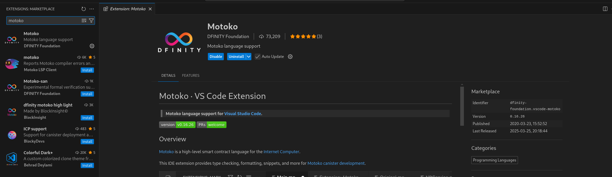
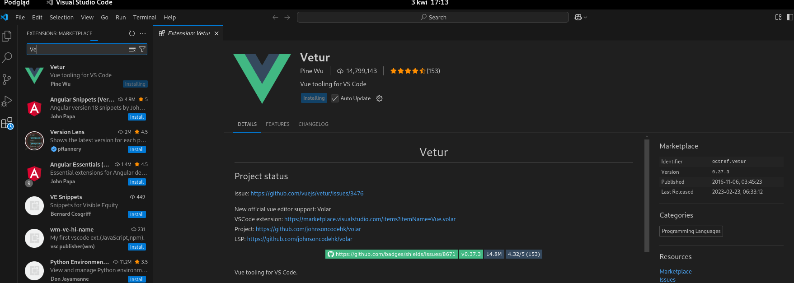
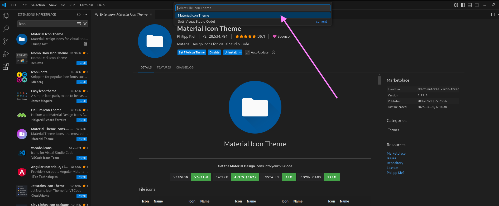

----------------------------------

Skrypt do szybkiej konfiguracji środowiska Developerskiego dla ICP na Ubuntu 

--------------------
1) Zapisujemy skrypt w katalogu
2) Uruchamiamy Terminal przechodzimy cd do Katalogu ze skryptem
3) Uruchamiamy polecenie bash ICP_Developerka_install.sh
   
Uruchamiamy to jako zwykły User z poziomu Terminala 
jeżeli znajdujecie się w tym samym katalogu w jakim jest skrypt| 

> bash ./ICP_Developerka_install.sh

🟡 Przed instalacją updatów skrypt może poprosić o podanie hasła root 
   w dalszej części skrypt dodaje do lokalnych zmiennych systemowych 
   ścieżki właściwe dla konta lokalnego w przypadku błędu dodawania 
   do zmiennych środowiskowych po prostu

   uruchom jeszcze raz skrypt ( on sobie sprawdzi aha zrobiłem update 
   i nie poprosi o hasło = będziesz go uruchamiał jako user ) 
   

Dodatkowo: 

Polecam doinstalować odpowiednie rozszerzenia (Extensions) w VSCode
1. Macie to tutaj po odpaleniu VS Code

2. Pakiet do rozpoznawania składni języka Motoko opracowany przez Dfinity

3. Pakiet dla Vue.js

4. Pakiet dla Material Icon ( Najs ikonki dla plików js,html, json )

-------------------

Jeżeli potrzeba wam więcej info odnośnie instalacji to tutaj wrzucam filmik na YT:

Tutorial na YouTube instalacji dfx za pomocą skryptu:

https://youtu.be/FbvFtoTqpyA

Instalacja DFX z oficjalnej strony Internet Computer:

https://internetcomputer.org/docs/building-apps/getting-started/install

--------------------
Zaoszczędzony czas można przeznaczyć na naukę starożytnego języka Motoko :D 
