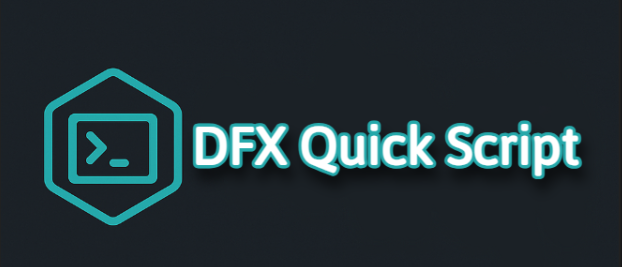
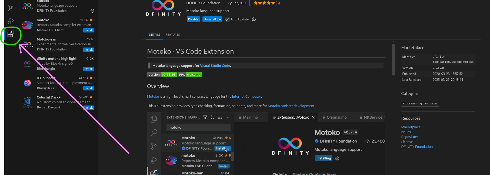

----------------------------------

Skrypt do szybkiej konfiguracji środowiska Developerskiego dla ICP na Ubuntu 

--------------------
1) Zapisujemy skrypt w katalogu
2) Uruchamiamy Terminal przechodzimy cd do Katalogu ze skryptem
3) Uruchamiamy polecenie bash ICP_Developerka_install.sh
   
Uruchamiamy to jako zwykły User z poziomu Terminala 
jeżeli znajdujecie się w tym samym katalogu w jakim jest skrypt| 

> bash ./ICP_Developerka_install.sh

Dodatkowo: 

Polecam doinstalować sobie w Extensions w VSCode

Tutorial na YouTube instalacji dfx za pomocą skryptu:

https://youtu.be/FbvFtoTqpyA

Instalacja DFX z oficjalnej strony Internet Computer:

https://internetcomputer.org/docs/building-apps/getting-started/install

--------------------
Zaoszczędzony czas można przeznaczyć na naukę starożytnego języka Motoko :D 
